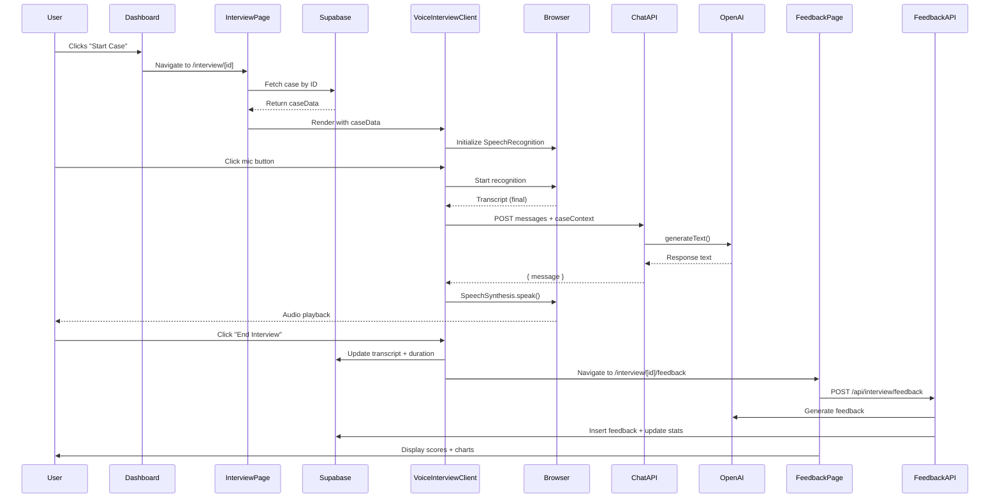

# Components Map - CaserAI

## Component Architecture Overview

```
VoiceInterviewClient (main container)
  ├─ AudioVisualizer (visual feedback)
  ├─ DataExhibitSlideover (case exhibits)
  │    └─ Card[] (exhibit items)
  └─ UI Components (Button, etc.)

Dashboard
  ├─ Stats Cards (user progress)
  ├─ Recent Interviews Grid
  └─ Available Cases Grid
       └─ Case Cards

Feedback Page
  ├─ Performance Cards
  ├─ PerformanceRadarChart
  ├─ TrendChart (if multiple interviews)
  └─ Strengths/Improvements Lists
```

---

## Core Business Components

### 1. VoiceInterviewClient ⭐ (PRIMARY COMPONENT)

**File**: `components/voice-interview-client.tsx`
**Type**: Client Component
**Purpose**: Orchestrates the entire case interview experience with voice interaction

#### Props Flow
```typescript
interface VoiceInterviewClientProps {
  caseData: {
    id: string              // From Supabase: cases.id
    title: string           // cases.title
    description: string     // cases.description
    prompt: string          // cases.prompt ← USED AS INITIAL MESSAGE
    industry: string        // cases.industry
    difficulty: string      // cases.difficulty
  }
  interviewId: string       // Generated in parent (interview/[id]/page.tsx:28 or 46)
  userId: string            // From mock auth (getMockUser().id)
}
```

**Source of Props**:
- Passed from `app/interview/[id]/page.tsx:49`
- `caseData` fetched via Supabase @ parent line 17:
  ```typescript
  const { data: caseData } = await supabase
    .from("cases")
    .select("*")
    .eq("id", id)
    .single()
  ```

#### State Management

**Local State** (lines 31-37):
```typescript
const [isListening, setIsListening] = useState(false)        // Mic recording
const [isSpeaking, setIsSpeaking] = useState(false)          // AI talking
const [messages, setMessages] = useState<Message[]>([])      // Transcript ⭐
const [interimTranscript, setInterimTranscript] = useState("")  // Live STT
const [hasStarted, setHasStarted] = useState(false)          // Interview begun
const [currentAIText, setCurrentAIText] = useState("")       // Text for typewriter
const [displayedAIText, setDisplayedAIText] = useState("")   // Animated text
```

**Refs** (lines 38-42):
```typescript
const recognitionRef = useRef<any>(null)          // SpeechRecognition instance
const synthRef = useRef<SpeechSynthesis | null>(null)  // TTS synthesizer
const supabase = createClient()                   // Supabase browser client
const startTimeRef = useRef<Date>(new Date())     // For duration tracking
```

#### Supabase Consumption

**WHERE: Save Transcript** (lines 206-214)
```typescript
await supabase
  .from("interviews")
  .update({
    status: "completed",
    completed_at: new Date().toISOString(),
    duration,                  // Calculated from startTimeRef
    transcript: messages,      // ⭐ STATE SAVED HERE
  })
  .eq("id", interviewId)
```

**WHEN**: Triggered by `endInterview()` function (line 199)
**CONDITIONAL**: Skipped if `interviewId.startsWith("demo-")` (demo mode bypass)

#### Voice UI Architecture

**Web Speech Recognition Setup** (lines 48-92):
```typescript
useEffect(() => {
  const SpeechRecognition = window.SpeechRecognition || window.webkitSpeechRecognition
  recognitionRef.current = new SpeechRecognition()
  recognitionRef.current.continuous = true      // Don't stop after pause
  recognitionRef.current.interimResults = true  // Show live transcript
  recognitionRef.current.lang = "en-US"

  recognitionRef.current.onresult = (event) => {
    // Extract final transcript → add to messages → trigger AI response
  }

  recognitionRef.current.onerror = (event) => {
    console.error("Speech recognition error:", event.error)
    setIsListening(false)
  }

  recognitionRef.current.onend = () => {
    if (isListening) recognitionRef.current?.start()  // Auto-restart
  }
}, [isListening])
```

**Web Speech Synthesis** (lines 153-169):
```typescript
const speakText = (text: string) => {
  synthRef.current?.cancel()  // Stop any current speech
  const utterance = new SpeechSynthesisUtterance(text)
  utterance.rate = 0.95       // Slightly slower than default
  utterance.pitch = 1
  utterance.volume = 1

  utterance.onstart = () => setIsSpeaking(true)
  utterance.onend = () => {
    setIsSpeaking(false)
    setCurrentAIText("")      // Clear typewriter text
  }

  synthRef.current?.speak(utterance)
}
```

**Typewriter Effect** (lines 105-124):
```typescript
useEffect(() => {
  if (!currentAIText) {
    setDisplayedAIText("")
    return
  }

  let index = 0
  setDisplayedAIText("")

  const interval = setInterval(() => {
    if (index < currentAIText.length) {
      setDisplayedAIText(currentAIText.slice(0, index + 1))
      index++
    } else {
      clearInterval(interval)
    }
  }, 30)  // 30ms per character

  return () => clearInterval(interval)
}, [currentAIText])
```

**UI Rendering** (lines 262-273):
```typescript
{isSpeaking && displayedAIText && (
  <p className="text-balance text-lg leading-relaxed text-foreground">
    {displayedAIText}
    <span className="animate-pulse">|</span>  // Blinking cursor
  </p>
)}
{isListening && interimTranscript && (
  <p className="text-balance text-lg leading-relaxed italic text-muted-foreground">
    {interimTranscript}  // Live speech-to-text
  </p>
)}
```

#### LLM Integration

**Chat API Call** (lines 126-151):
```typescript
const handleAIResponse = async (userInput: string) => {
  try {
    const response = await fetch("/api/interview/chat", {
      method: "POST",
      headers: { "Content-Type": "application/json" },
      body: JSON.stringify({
        messages: [...messages, { role: "user", content: userInput }],
        caseContext: caseData,  // ⭐ CASE CONTENT SENT HERE
        interviewId,
      }),
    })

    const data = await response.json()
    const aiMessage: Message = {
      role: "assistant",
      content: data.message,
      timestamp: new Date(),
    }

    setMessages((prev) => [...prev, aiMessage])
    setCurrentAIText(data.message)  // Trigger typewriter
    speakText(data.message)         // Trigger TTS
  } catch (error) {
    console.error("Error getting AI response:", error)
  }
}
```

**Triggered by**: `recognitionRef.current.onresult` when final transcript received (line 76)

#### Exhibit Rendering

**CURRENT STATE - TEMP HARD-CODE** (lines 323-336):
```typescript
const sampleExhibits = [
  {
    id: "1",
    title: "Market Size Analysis",
    type: "chart" as const,
    data: {},  // ⚠️ EMPTY DATA
  },
  {
    id: "2",
    title: "Revenue Breakdown",
    type: "table" as const,
    data: {},  // ⚠️ EMPTY DATA
  },
]
```

**WHERE RENDERED** (line 242):
```typescript
<DataExhibitSlideover exhibits={sampleExhibits} />
```

**⚠️ FUTURE IMPLEMENTATION - Replace with Database Fetch**:
```typescript
// ADD THIS AFTER LINE 42
const [exhibits, setExhibits] = useState<DataExhibit[]>([])

useEffect(() => {
  async function fetchExhibits() {
    const { data } = await supabase
      .from('case_exhibits')  // ⚠️ TABLE DOES NOT EXIST YET
      .select('*')
      .eq('case_id', caseData.id)
      .order('display_order')

    if (data) {
      setExhibits(data.map(ex => ({
        id: ex.id,
        title: ex.label,
        type: 'chart',
        imageUrl: ex.image_url,      // ⭐ NEW FIELD
        summary: ex.chart_summary    // ⭐ FOR LLM CONTEXT
      })))
    }
  }
  fetchExhibits()
}, [caseData.id])

// THEN UPDATE LINE 242 TO:
<DataExhibitSlideover exhibits={exhibits} />
```

#### Echo SDK Integration Points

**🔐 Auth Gate** (ADD BEFORE LINE 172):
```typescript
const startInterview = async () => {
  // Check if user has interview quota
  const canStart = await echo.checkQuota('interviews')
  if (!canStart) {
    // Show paywall modal
    setShowUpgradeModal(true)
    return
  }

  setHasStarted(true)
  // ... existing code
}
```

**💰 Metered Chat** (REPLACE LINE 128):
```typescript
const handleAIResponse = async (userInput: string) => {
  // Check quota before API call
  const canChat = await echo.checkQuota('chat_messages')
  if (!canChat) {
    // Show "upgrade to continue" message
    speakText("You've reached your message limit. Please upgrade to continue.")
    return
  }

  // Existing fetch call...
}
```

**📊 Usage Display** (ADD TO UI):
```typescript
// Show in header (line 228-239)
<div className="text-sm text-muted-foreground">
  Messages: {usedMessages}/{totalMessages}
</div>
```

#### Component Summary

| Aspect | Location | Status | Future Action |
|--------|----------|--------|---------------|
| **Voice Input** | Lines 48-92 | ✅ Working | Add browser fallback |
| **Voice Output** | Lines 153-169 | ✅ Working | Consider premium TTS |
| **Transcript State** | Line 33 | ✅ Working | Add export feature |
| **Supabase Write** | Lines 206-214 | ✅ Working | None needed |
| **LLM Call** | Lines 128-136 | ⚠️ No metering | Add Echo SDK |
| **Exhibits** | Lines 323-336 | ❌ Hard-coded | Fetch from DB |
| **Echo Gates** | N/A | ❌ Missing | Add quota checks |

---

### 2. DataExhibitSlideover

**File**: `components/data-exhibit-slideover.tsx`
**Type**: Client Component
**Purpose**: Slideover panel displaying case exhibits (charts, tables, images)

#### Props Flow
```typescript
interface DataExhibit {
  id: string
  title: string
  type: "chart" | "table" | "image"
  data: any  // ⚠️ Currently unused
}

interface DataExhibitSlideoverProps {
  exhibits?: DataExhibit[]  // Optional, defaults to []
}
```

**Prop Source**: Hard-coded in VoiceInterviewClient (voice-interview-client.tsx:242)

#### State
```typescript
const [isOpen, setIsOpen] = useState(false)  // Slideover visibility
```

#### Current Rendering (PLACEHOLDER)

**WHERE: Exhibit Content** (lines 68-74):
```typescript
<div className="rounded-lg bg-muted p-4">
  <div className="flex h-48 items-center justify-center text-sm text-muted-foreground">
    {exhibit.type === "chart" && "Chart visualization"}   // ⚠️ TEXT ONLY
    {exhibit.type === "table" && "Table data"}            // ⚠️ TEXT ONLY
    {exhibit.type === "image" && "Image exhibit"}         // ⚠️ TEXT ONLY
  </div>
</div>
```

#### 🎯 FUTURE IMPLEMENTATION - Real Exhibits

**STEP 1: Update Interface** (lines 9-14):
```typescript
interface DataExhibit {
  id: string
  title: string
  type: "chart" | "table" | "image"
  imageUrl?: string        // ⭐ ADD THIS
  chartSummary?: string    // ⭐ FOR LLM CONTEXT
  data?: any
}
```

**STEP 2: Update Rendering** (REPLACE lines 68-74):
```typescript
<div className="rounded-lg bg-muted p-4">
  {exhibit.imageUrl ? (
    
  ) : (
    // Fallback to placeholder
    <div className="flex h-48 items-center justify-center text-sm text-muted-foreground">
      No preview available
    </div>
  )}
</div>
```

**STEP 3: Add Chart Summary** (ADD after image):
```typescript
{exhibit.chartSummary && (
  <p className="mt-2 text-sm text-muted-foreground">
    {exhibit.chartSummary}
  </p>
)}
```

#### Echo Integration

**💎 Premium Exhibits** (lines 65-77):
```typescript
{exhibits.map((exhibit) => (
  <Card key={exhibit.id} className="p-4">
    <h3 className="mb-3 font-medium">{exhibit.title}</h3>
    {exhibit.isPremium && !isPro ? (
      <div className="flex h-48 items-center justify-center">
        <Button onClick={openUpgradeModal}>
          Unlock Premium Exhibit
        </Button>
      </div>
    ) : (
      // Show actual exhibit
    )}
  </Card>
))}
```

#### Component Summary

| Aspect | Status | Note |
|--------|--------|------|
| **Slideover UI** | ✅ Working | Animation works well |
| **Exhibit Data** | ❌ Hard-coded | Need DB fetch in parent |
| **Image Rendering** | ❌ Placeholder | Update lines 68-74 |
| **Premium Gate** | ❌ Missing | Add Echo check |

---

### 3. AudioVisualizer

**File**: `components/audio-visualizer.tsx`
**Type**: Client Component
**Purpose**: Animated yellow blob + waveform for voice feedback

#### Props Flow
```typescript
interface AudioVisualizerProps {
  isActive: boolean      // AI is speaking (from parent isSpeaking state)
  isListening: boolean   // User is speaking (from parent isListening state)
}
```

**Prop Source**: VoiceInterviewClient (voice-interview-client.tsx:259)

#### State
```typescript
const canvasRef = useRef<HTMLCanvasElement>(null)  // For waveform rendering
const animationRef = useRef<number>()               // RAF ID for cleanup
```

#### Rendering Logic

**Blob Animation** (lines 54-85):
```typescript
<div className="relative h-64 w-64">
  {/* Main blob with morph animation */}
  <div className={`absolute inset-0 rounded-full bg-yellow-400 transition-all duration-300 ${
    isActive ? "animate-blob-morph shadow-[0_0_60px_rgba(250,204,21,0.6)]" : ""
  }`} />

  {/* Secondary layer for depth */}
  <div className={`absolute inset-2 rounded-full bg-yellow-400/80 ${
    isActive ? "animate-blob-morph-alt" : ""
  }`} />

  {/* Inner glow */}
  <div className={`absolute inset-8 rounded-full bg-yellow-300/60 ${
    isActive ? "animate-blob-pulse" : ""
  }`} />
</div>
```

**Waveform Bars** (lines 14-50):
```typescript
useEffect(() => {
  const canvas = canvasRef.current
  const ctx = canvas.getContext("2d")

  const draw = () => {
    ctx.clearRect(0, 0, canvas.width, canvas.height)

    if (isListening) {
      for (let i = 0; i < bars; i++) {
        const height = Math.random() * (canvas.height * 0.6) + canvas.height * 0.1
        const x = i * barWidth
        const y = centerY - height / 2

        ctx.fillStyle = "hsl(var(--muted-foreground))"
        ctx.fillRect(x + barWidth * 0.2, y, barWidth * 0.6, height)
      }
    }

    animationRef.current = requestAnimationFrame(draw)
  }

  draw()
  return () => cancelAnimationFrame(animationRef.current)
}, [isListening])
```

**Conditional Display** (line 88):
```typescript
{isListening && <canvas ref={canvasRef} width={400} height={80} />}
```

#### Supabase Consumption
**NONE** - Pure UI component, no data dependencies

#### Echo Integration
**NONE** - No business logic to gate

#### Component Summary
| Aspect | Status | Note |
|--------|--------|------|
| **Blob Animation** | ✅ Working | CSS-based, performant |
| **Waveform** | ✅ Working | Random bars (not real audio) |
| **Dependencies** | ✅ None | Can reuse anywhere |

---

### 4. PerformanceRadarChart

**File**: `components/performance-radar-chart.tsx`
**Type**: Client Component (assumed - not examined in detail)
**Purpose**: Radar chart visualization for feedback scores

#### Props Flow (Inferred)
```typescript
interface PerformanceData {
  category: string  // "Structure", "Analysis", "Communication", "Overall"
  score: number     // 0-100
}

interface PerformanceRadarChartProps {
  data: PerformanceData[]
}
```

**Prop Source**: app/interview/[id]/feedback/page.tsx:104-109
```typescript
const performanceData = [
  { category: "Structure", score: feedback.structure_score },
  { category: "Analysis", score: feedback.analysis_score },
  { category: "Communication", score: feedback.communication_score },
  { category: "Overall", score: feedback.overall_score },
]
```

**Rendered at**: feedback/page.tsx:185

#### Supabase Consumption
- Indirect via `feedback` object from Supabase query @ feedback/page.tsx:43-47

#### Echo Integration
**💎 Premium Feature**:
- Could show simplified chart for free users
- Detailed breakdown for pro users
- Historical comparisons for enterprise

---

### 5. TrendChart

**File**: `components/trend-chart.tsx`
**Type**: Client Component (assumed)
**Purpose**: Line chart showing performance over time

#### Props Flow (Inferred)
```typescript
interface TrendData {
  date: string   // "Jan 15"
  score: number  // 0-100
}

interface TrendChartProps {
  data: TrendData[]
}
```

**Prop Source**: app/interview/[id]/feedback/page.tsx:67-71
```typescript
const trendData = allInterviews?.map((int: any) => ({
  date: new Date(int.completed_at).toLocaleDateString("en-US", { month: "short", day: "numeric" }),
  score: int.feedback?.[0]?.overall_score || 0,
})) || []
```

**Rendered at**: feedback/page.tsx:197 (conditional - only if `trendData.length > 1`)

#### Supabase Consumption
- Fetched via `allInterviews` query @ feedback/page.tsx:60-65
- Queries all completed interviews for current user

#### Echo Integration
**🔒 Free Tier Limit**:
```typescript
// Show only last 3 interviews for free users
const limitedTrendData = isPro
  ? trendData
  : trendData.slice(-3)

{limitedTrendData.length > 1 && (
  <Card>
    <CardHeader>
      <CardTitle>Progress Over Time</CardTitle>
      {!isPro && (
        <Badge>Upgrade to see full history</Badge>
      )}
    </CardHeader>
    <CardContent>
      <TrendChart data={limitedTrendData} />
    </CardContent>
  </Card>
)}
```

---

## UI Component Library (components/ui/)

**Total Files**: 60+ components (Button, Card, Dialog, etc.)
**Source**: Shadcn/ui + v0 auto-generation
**Status**: ✅ Production-ready
**Dependencies**: Radix UI primitives

### Important Notes

**v0 Artifacts**:
- All files auto-generated by v0.app
- Safe to regenerate if broken
- Customizations should be documented

**Commonly Used**:
- `Button` - Primary actions throughout app
- `Card` - Container for all content blocks
- `Dialog` - Modals (future: upgrade prompts)
- `Sheet` - Slideover (used in DataExhibitSlideover)
- `Progress` - Score bars in feedback
- `Badge` - Difficulty/status indicators

**Echo Integration**:
- Use `Dialog` for paywall modals
- Use `Badge` for plan indicators ("PRO", "FREE")
- Use `Alert` for quota warnings

---

## Component Interaction Flow

### Interview Flow (Happy Path)



### Data Flow Diagram

```
┌─────────────────────────────────────────────────────────┐
│                     Supabase Database                    │
│                                                          │
│  cases ──────┐                                          │
│  (case data) │                                          │
└──────────────┼──────────────────────────────────────────┘
               │
               ▼
┌──────────────────────────┐
│ interview/[id]/page.tsx  │ ← Server Component
│ - Fetch caseData         │
│ - Create interview ID    │
└────────────┬─────────────┘
             │ (props)
             ▼
┌─────────────────────────────────────────────────────┐
│        VoiceInterviewClient (Client Component)      │
│                                                      │
│  ┌──────────────┐  ┌────────────────┐             │
│  │ Voice Input  │  │  LLM Response  │             │
│  │  (STT API)   │→ │  (Chat API)    │             │
│  └──────────────┘  └────────────────┘             │
│                                                      │
│  messages[] state ───────┐                         │
│                           │                         │
│  ┌────────────────┐      │                         │
│  │ DataExhibit    │      │                         │
│  │ Slideover      │      │                         │
│  │ (hard-coded)   │      │                         │
│  └────────────────┘      │                         │
└──────────────────────────┼─────────────────────────┘
                           │ (save on end)
                           ▼
              ┌────────────────────────┐
              │   Supabase Database    │
              │  interviews.transcript │
              └────────────────────────┘
```

---

## Churn Risk Assessment (v0 Artifacts)

### Low Risk (Keep As-Is)
- ✅ All `components/ui/*` - Standard Shadcn patterns
- ✅ AudioVisualizer - Custom, no v0 dependencies
- ✅ DataExhibitSlideover - Simple state, easy to maintain

### Medium Risk (May Need Adjustment)
- ⚠️ VoiceInterviewClient - Complex state management
  - If regenerated, would lose voice logic
  - Keep original, only modify specific sections
- ⚠️ PerformanceRadarChart - Recharts dependency
  - v0 might regenerate with different chart library
- ⚠️ TrendChart - Same risk as radar chart

### High Risk (Do Not Regenerate)
- 🔴 VoiceInterviewClient - **CRITICAL COMPONENT**
  - Contains all voice + LLM integration logic
  - If broken, manually fix - do not ask v0 to regenerate

---

## Component Modification Checklist

When modifying components for Echo integration:

**VoiceInterviewClient**:
- [ ] Add Echo quota check before `startInterview()` (line 171)
- [ ] Add Echo metering in `handleAIResponse()` (line 126)
- [ ] Replace hard-coded exhibits with DB fetch (line 323)
- [ ] Add usage display in header UI
- [ ] Add upgrade modal component

**DataExhibitSlideover**:
- [ ] Update interface to include `imageUrl` field
- [ ] Replace placeholder rendering with actual images (line 68)
- [ ] Add premium exhibit gating

**Dashboard** (not in this file, but related):
- [ ] Add Echo usage widget
- [ ] Add quota warnings near "Start Case" button

**Feedback Page**:
- [ ] Add upsell for detailed feedback
- [ ] Gate trend chart for free users
- [ ] Add "share results" premium feature

---

**End of Components Map** | All hard-coded content locations marked with ⚠️
